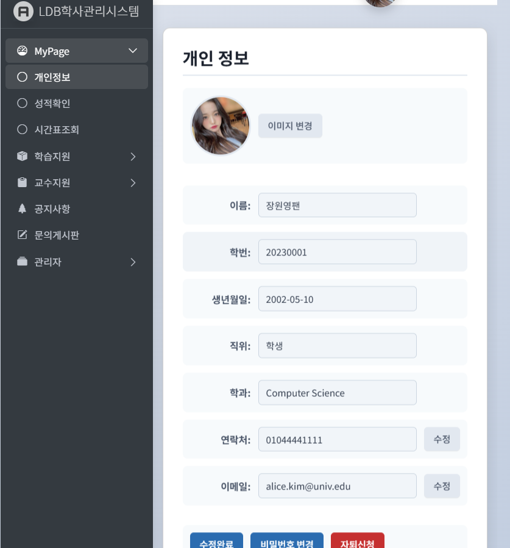
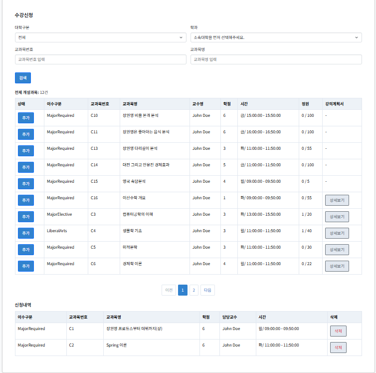
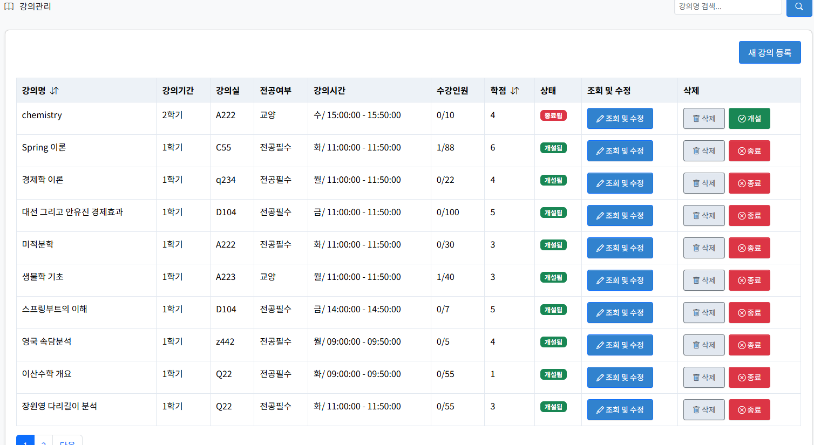

# 🎓 학사 관리 시스템 (Academic Management System)


> JSP + SpringBoot + MyBatis 기반의 Model2 MVC 패턴 웹 프로젝트</br>
> Bootstrap5 및 AdminLTE4 템플릿 기반 반응형 UI 학사관리 시스템</br>
> 시연영상 링크: https://youtu.be/ACZ_0ZXrgKQ</br>
> ppt다운로드: https://github.com/Limjuhan/LMS-Project/blob/main/LMS.pptx
---

## 📸 데모 스크린샷

> 아래는 실제 시스템 UI의 예시입니다.

<table>
  <tr>
    <th>개인정보 화면</th>
    <th>수강 신청 화면</th>
    <th>강의 관리 화면</th>
  </tr>
  <tr>
    <td align="center">
      
    </td>
    <td align="center">
      
    </td>
    <td align="center">
      
    </td>
  </tr>
</table>

---

## 📌 프로젝트 개요

**학사 관리 시스템**은 학생과 교수 간의 효율적인 학사 행정 처리를 돕기 위해 개발된 웹 기반 시스템입니다.  
학생은 수강신청, 시간표 확인, 성적 확인 등의 기능을 사용할 수 있으며, 교수는 수업 등록, 출석 체크, 성적 입력 등을 수행할 수 있습니다.  
또한, 공지사항과 문의 게시판 기능을 통해 원활한 커뮤니케이션 환경을 제공합니다.

---

## 🎯 주요 기능

### 👩‍🎓 학생 기능
- 학생 등록 및 정보 관리
- 수강 신청 및 취소
- 시간표 확인
- 성적 확인
- 문의 게시판 등록/조회

### 👨‍🏫 교수 기능
- 수업 개설 및 관리
- 출석 체크
- 성적 입력 및 수정
- 공지사항 게시판 작성

### 📢 공통 기능
- 공지사항 열람
- 게시판 답변
- 관리자 기능 (학생/교수 등록 및 전반적 관리)

---

### 📂 개발 환경
  - IDE: Eclipse (Dynamic Web Project)
  - Java 17
  - Spring Boot + Embedded Tomcat
  - View: JSP + JSTL + Bootstrap 5
  - ORM: MyBatis (XML Mapper)
  - DBMS: MariaDB
| **아키텍처**    | Model2 (MVC 패턴) 방식 |

---

## 🌳 프로젝트 구조
```
LMS-Project/
├── 📄 .gitattributes
├── 📄 .gitignore
├── ⚙️ .mvn/                  # Maven Wrapper 관련 파일
│   └── 📁 wrapper/
│       ├── 📄 maven-wrapper.jar
│       └── 📄 maven-wrapper.properties
├── 📄 pom.xml                # Maven 빌드 설정 파일
├── 📄 README.md              # 프로젝트 정보 문서 (이 문서가 들어갈 위치)
└── 📦 src/
    └── 📂 main/
        ├── ☕ java/
        │   └── 📂 com/
        │       └── 📂 ldb/
        │           └── 📂 lms/
        │               ├── 🌐 controller/  # 웹 요청 처리 및 응답 담당
        │               │   ├── 📁 board/ # 게시판 컨트롤러
        │               │   ├── 📁 learning_support/ # 수강신청 컨트롤러
        │               │   ├── 📁 mypage/ # 마이페이지 컨트롤러
        │               │   └── 📁 professor_support/ # 교수 기능 컨트롤러
        │               ├── ⚙️ config/      # 애플리케이션 설정 클래스
        │               ├── 📚 domain/      # 데이터베이스 테이블과 매핑되는 도메인 객체
        │               ├── 🚀 DemoApplication.java # Spring Boot 애플리케이션 시작점
        │               ├── 🧩 mapper/      # MyBatis Mapper 인터페이스 (SQL 호출)
        │               └── 🛠️ service/     # 비즈니스 로직 처리 계층
        ├── 📝 resources/     # 각종 리소스 및 설정 파일
        │   ├── 🗃️ mapper/      # MyBatis SQL Mapper XML 파일
        │   │   ├── 📁 board/ # 게시판 Mapper XML
        │   │   ├── 📁 learning_support/ # 수강신청 Mapper XML
        │   │   ├── 📁 mypage/ # 마이페이지 Mapper XML
        │   │   └── 📁 professor_support/ # 교수 기능 Mapper XML
        │   ├── 📄 mybatis.properties # MyBatis 설정 파일
        │   ├── 📄 mybatis-config.xml # MyBatis 구성 파일
        │   └── 🌐 static/       # 웹에서 직접 접근 가능한 정적 리소스 (CSS, JS, 이미지)
        │       ├── 🎨 css/
        │       ├── 🖼️ img/
        │       └── 💡 js/
        └── 🖥️ webapp/        # 웹 애플리케이션 관련 파일
            └── 🔒 WEB-INF/    # 보안상 외부 직접 접근 불가 영역
                └── 📄 views/     # JSP 화면 파일
                    ├── 📁 admin/
                    ├── 📁 board/
                    ├── 📄 home.jsp
                    ├── 📁 lecture/
                    ├── 📄 login.jsp
                    └── 📁 mypage/
```
---
## 🔧 향후 개선 예정

> 학사 관리 시스템은 현재 **Spring Boot 3와 Maven으로의 마이그레이션**을 진행 중이며, 이를 통해 현대적인 웹 애플리케이션으로 전환하고자 합니다.  
> 마이그레이션 완료 후에는 보안 강화, UI 개선, 확장성을 위한 **고도화** 작업을 계획하고 있습니다.  
> 아래는 마이그레이션 및 고도화 과정에서의 고민과 향후 계획입니다.
---
### 🚀 Spring Boot 3 마이그레이션✅(완료)
현재 JSP + Servlet 기반의 Model2 아키텍처를 Spring Boot 3와 Maven으로 전환 중입니다.  
이 과정은 기존 기능을 유지하면서 코드 구조와 빌드 환경을 현대화하는 데 초점을 맞추고 있습니다.

#### 📋 마이그레이션 계획(완료)
- **기술 스택 전환**:
  - ✅ Servlet → Spring MVC `@Controller`로 전환 (JSP 렌더링 및 AJAX 통합).
  - ✅ 수동 JAR 관리 → Maven `pom.xml`로 의존성 관리.
  - ✅ `web.xml` 제거, Spring Boot 자동 설정 도입.
- **계층 구조 개선**:
  - ✅ DAO 제거, MyBatis Mapper 직접 사용 (`CourseMapper`, `CourseMapper.xml`).
  - ✅ Service 계층 추가 (`CourseService`)로 비즈니스 로직 분리.
  - ✅ `@Transactional` 적용으로 트랜잭션 관리 강화.
- **고민**:
  - 기존 서블릿과 JSP의 복잡한 로직을 Spring MVC로 자연스럽게 전환.
  - MyBatis 쿼리 호환성 유지 (기존 `CourseMapper.xml` 재사용).
  - 마이그레이션 후 기능 안정성 테스트.

#### 🛠️ 예상 결과
- **유지보수성 향상**: Spring Boot의 자동 설정과 Maven으로 코드 관리 간소화.
- **확장성 강화**: Service 계층으로 로직 분리, 재사용성↑.
- **개발 효율성**: Spring Boot DevTools로 빠른 개발/디버깅.

### 🔒 보안 고도화 (Spring Security 도입)
현재 시스템은 세션 기반 로그인(`HttpSession`)을 사용 중이나, 보안 강화를 위해 **Spring Security** 도입을 검토 중입니다.  
Spring Security에 대한 학습 부담이 있지만, 점진적 적용으로 부담을 최소화할 계획입니다.

#### 📋 보안 개선 계획
- **기본 인증/인가**:
  - 학생(`/learning_support/*`) 및 교수(`/professor_support/*`) 역할 기반 접근 제어.
  - 커스텀 로그인 페이지(`/login.jsp`) 구현.
  - 초기 테스트: 인메모리 사용자(`s001`, `p001`).
- **DB 연동**:
  - MyBatis Mapper(`UserMapper`)로 사용자 조회.
  - 비밀번호 암호화(BCrypt) 적용.
- **고민**:
  - Spring Security의 복잡한 설정 학습.
  - 기존 세션 로그인과의 점진적 통합.
  - 인증 실패 시 사용자 경험(에러 메시지, UI) 개선.

#### 🛠️ 예상 결과
- **보안 강화**: 역할 기반 접근 제어로 무단 접근 차단.
- **유연성**: DB 연동으로 사용자 관리 확장 가능.
- **사용자 경험**: 직관적인 로그인/로그아웃 흐름.

### 🌟 UI 및 프론트엔드 개선
JSP 기반 UI를 유지하되, 현대적인 템플릿 엔진 도입과 반응형 디자인 강화를 검토 중입니다.

#### 📋 UI 개선 계획
- **Thymeleaf 전환 검토**:
  - JSP → Thymeleaf로 점진적 전환 (Spring Boot 권장).
  - 장점: 서버-클라이언트 분리 용이, 유지보수성↑.
  - 고민: JSP 의존도 높은 기존 코드의 전환 비용.
- **프론트엔드 최적화**:
  - Bootstrap 5 및 AdminLTE 4 업그레이드.
  - AJAX 호출 최적화 (예: `/learning_support/searchCourse` 응답 시간 단축).
  - 모바일 반응형 디자인 개선.

#### 🛠️ 예상 결과
- **현대적 UI**: Thymeleaf로 깔끔한 템플릿 관리.
- **사용자 경험**: 빠른 응답, 모바일 친화적 인터페이스.

### 🚀 확장성 및 REST API 강화
향후 SPA(React, Vue.js) 또는 모바일 앱 지원을 위해 REST API 기반 아키텍처로 확장할 가능성을 염두에 두고 있습니다.

#### 📋 확장 계획
- **REST API 도입**:
  - `@RestController`로 API 엔드포인트 분리 (예: `/api/learning_support/*`).
  - 기존 AJAX 호출(`/searchCourse`)을 RESTful API로 표준화.
- **고민**:
  - `@Controller` 내 AJAX 메서드와의 통합 vs. 분리.
  - API 문서화(Swagger) 필요성.
- **미래 비전**:
  - 프론트엔드 SPA 전환.
  - 모바일 앱 지원.

#### 🛠️ 예상 결과
- **확장성**: 다양한 클라이언트 지원 가능.
- **표준화**: RESTful API로 외부 시스템 연동 용이.

### 📅 마이그레이션 및 고도화 로드맵
| 단계 | 작업 내용 | 예상 기간 | 우선순위 |
|------|-----------|-----------|----------|
| **✅** | Spring Boot 3 및 Maven 마이그레이션 | ~2025.06 | ⭐⭐⭐ |
| **✅** | Service 계층 추가, DAO 제거 | ~2025.06 | ⭐⭐⭐ |
| **3** | 고도화 작업 | ~2025.xx | ⭐⭐ |


### 🤔 주요 고민
- **마이그레이션 안정성**: 기존 기능(수강신청, 강의관리)의 완벽한 재현.
- **Spring Security 학습**: 복잡한 설정에 대한 점진적 접근.
- **JSP vs. Thymeleaf**: 전환 비용과 유지보수성 tradeoff.
- **확장성**: REST API 도입 시점과 프론트엔드 리팩토링 우선순위.

### 🎯 최종 비전
Spring Boot 3로 마이그레이션 완료 후, 보안(Security), UI(Thymeleaf), 확장성(REST API)을 강화하여 **현대적이고 확장 가능한 학사관리시스템**으로 발전시키는 것입니다.  
이를 통해 학생과 교수의 사용자 경험을 극대화하고, 유지보수 및 새로운 기능 추가가 용이한 시스템을 구축할 계획입니다.

---
